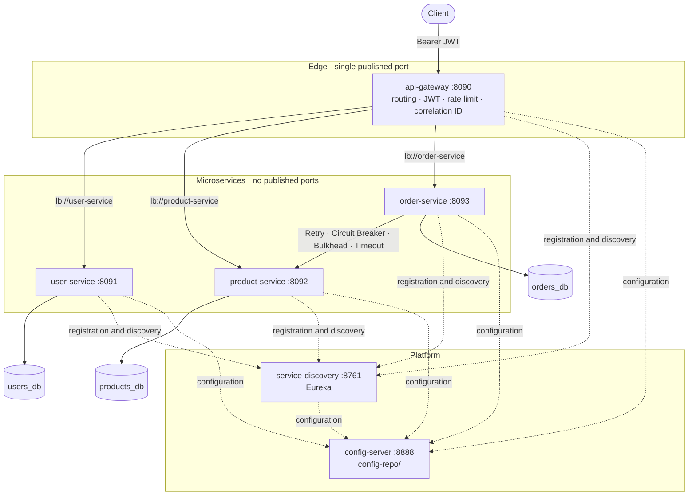

[🇪🇸 Español](README.md) | **🇬🇧 English**

# microservices-platform


A backend microservices platform with **Java 21, Spring Boot and Spring Cloud**: API Gateway, Service
Discovery, centralized configuration, JWT, a database per service and service-to-service communication
that **fails in a controlled way and recovers on its own** (timeout, retry, circuit breaker, bulkhead and
rate limiting). Everything starts with `docker compose up --build` and is verified by automated tests,
including real failures against the running stack.

## Contents

1. [Overview](#1-overview)
2. [Architecture](#2-architecture)
3. [Technologies](#3-technologies)
4. [Services](#4-services)
5. [Lifecycle of a request](#5-lifecycle-of-a-request)
6. [Authentication](#6-authentication)
7. [Service Discovery](#7-service-discovery)
8. [Configuration](#8-configuration)
9. [Resilience](#9-resilience)
10. [Database strategy](#10-database-strategy)
11. [How to run it](#11-how-to-run-it)
12. [API](#12-api)
13. [Tests](#13-tests)
14. [Failure simulation](#14-failure-simulation)
15. [API documentation (Swagger)](#15-api-documentation-swagger)
16. [Observability](#16-observability)
17. [Production considerations](#17-production-considerations)
18. [Project structure](#18-project-structure)
19. [Author](#author)
20. [License](#license)

---

## 1. Overview

Splitting a backend into services is easy. The hard part is what happens **between** them: how they
find each other without fixed IPs, how they share configuration without duplicating it, how they protect
themselves without blindly trusting the internal network and, above all, what happens when one fails.

This project solves those problems with a concrete case: users, catalog and orders. To create an order,
`order-service` queries `product-service` and validates existence, status, price and stock. That
synchronous call is where a failure could cascade, and it's where the resilience patterns are
concentrated:

- If **product-service doesn't respond**, order-service doesn't wait forever: 2 s timeout.
- If **it fails transiently** (503, dropped connection), it's retried with backoff; if the error is
  permanent (404, 500), it isn't retried.
- If **it keeps failing**, the circuit breaker opens and requests fail in milliseconds with a clear
  error, without touching the network, until the service recovers.
- If **it's slow**, the bulkhead prevents it from taking all of order-service's threads.

None of this is just configured: there are tests that trigger it (WireMock in integration, real
failures on docker compose in E2E) and check the behavior.

## 2. Architecture



Detailed documentation with more diagrams (sequences, order states, data model, startup):
[docs/architecture.md](docs/architecture.md). Decisions and rejected alternatives:
[docs/architecture-decisions.md](docs/architecture-decisions.md).

## 3. Technologies

| Area                  | Technology                                                                        |
|-----------------------|-----------------------------------------------------------------------------------|
| Language and framework | Java 21, Spring Boot 3.5.4, Maven (multi-module, Maven Wrapper)                  |
| Spring Cloud          | 2025.0.0 (Northfields, the line compatible with Boot 3.5): Gateway (WebFlux), Netflix Eureka, Config Server, LoadBalancer |
| Security              | Spring Security, OAuth2 Resource Server (JWT HS256 with Nimbus), BCrypt           |
| Resilience            | Resilience4j 2.2.0 (Circuit Breaker, Retry, Bulkhead) · custom rate limiter on the gateway |
| Persistence           | Spring Data JPA, PostgreSQL 16, Flyway                                            |
| HTTP client           | `@LoadBalanced` `RestClient` + Apache HttpClient 5                                |
| Observability         | Spring Boot Actuator, Micrometer, Micrometer Tracing (OpenTelemetry bridge), JSON logs (ECS) |
| API                   | OpenAPI 3 / Swagger UI (springdoc 2.8.9)                                          |
| Tests                 | JUnit 5, Mockito, AssertJ, Testcontainers 1.21.4, WireMock 3.13, Awaitility       |
| Containers            | Docker (multi-stage, Alpine JRE, unprivileged user), Docker Compose               |

Versions were taken from mutually compatible BOMs: Spring Cloud 2025.0.x for Boot 3.5.x, and
Resilience4j managed by the Spring Cloud BOM.

## 4. Services

| Service             | Responsibility                                                                     |
|---------------------|------------------------------------------------------------------------------------|
| `api-gateway`       | Single entry point. Routes via Service Discovery, validates the JWT, applies rate limiting, generates and propagates the correlation ID, translates its own errors to JSON. **No business logic**. |
| `service-discovery` | Eureka Server. Registry of instances with their health status (protected with basic auth). |
| `config-server`     | Spring Cloud Config Server. Serves `config-repo/` per service and profile (protected with basic auth). |
| `user-service`      | Users, roles (`USER`, `ADMIN`), sign-up, login with BCrypt and JWT issuing.        |
| `product-service`   | Catalog. Read for `USER`/`ADMIN`; create, update and soft delete `ADMIN` only.     |
| `order-service`     | Orders and their lifecycle. Validates each product against product-service with Resilience4j. |
| `platform-commons`  | A library (not a service): correlation ID, error format and JWT validation shared by the business services. No domain. |

## 5. Lifecycle of a request

```
Client
  │  POST /api/orders   Authorization: Bearer <JWT>
  ▼
api-gateway ── X-Correlation-ID, JWT validation, per-user rate limit
  │  lb://order-service  (UP instance according to Eureka)
  ▼
order-service ── validates the JWT again and the role
  │  GET http://product-service/api/products/{id}
  │  + user's JWT + X-Correlation-ID + traceparent
  │  Retry( CircuitBreaker( Bulkhead( HTTP with timeout ) ) )
  ▼
product-service ── validates the JWT again and the role, reads products_db
  │  200 {price, stock, active}
  ▼
order-service ── active product, enough stock, total = Σ price × quantity
  │  stores the order in orders_db (local transaction, opened after the remote calls)
  ▼
Client  ◄── 201 Created  {status: CREATED, total, items…}   X-Correlation-ID
```

## 6. Authentication

1. `POST /api/users/register` creates a user with the `USER` role. The password is stored with BCrypt.
2. `POST /api/users/login` returns:
   ```json
   { "accessToken": "eyJhbGciOiJIUzI1NiJ9…", "tokenType": "Bearer", "expiresIn": 3600 }
   ```
3. Every other request carries `Authorization: Bearer <accessToken>`.

The JWT (HS256) only contains `iss`, `sub` (user id), `role`, `iat` and `exp`: no email or personal data.
The **signature, expiration, issuer and that the role exists** are validated, twice:

- at the **gateway**, so unauthenticated traffic doesn't enter the internal network;
- in **each service**, which also applies its own authorization (roles per endpoint, orders visible only
  to their owner or an ADMIN). A service doesn't trust a request just because it comes from inside the
  network. order-service forwards the user's JWT to product-service, which validates it the same way.

The first `ADMIN` is created at startup from `ADMIN_USERNAME` / `ADMIN_PASSWORD`. If `ADMIN_PASSWORD`
isn't set, it isn't created: there are no default credentials. An ADMIN can change the role of other
users or disable them (`PATCH /api/users/{id}`).

Other measures: login responds the same (and with the same BCrypt cost) whether the user doesn't exist,
the password is wrong or the account is disabled, and it's limited to 10 attempts per minute per IP.

## 7. Service Discovery

Each service registers with Eureka at startup using the IP Docker assigns it, and renews its
registration every 5 s. The gateway routes to `lb://user-service`, `lb://product-service` and
`lb://order-service`, and order-service calls `http://product-service`. Spring Cloud LoadBalancer
resolves those names against Eureka on every call. There's no IP or `localhost:port` anywhere in the
configuration.

Services publish their `/actuator/health` to Eureka (`eureka.client.healthcheck.enabled`). If, for
example, product-service loses its database, it goes `DOWN` and the gateway stops sending it traffic.
Dashboard: http://localhost:8761 (user and password from `EUREKA_USERNAME` / `EUREKA_PASSWORD`).

## 8. Configuration

The Config Server serves the [`config-repo/`](config-repo) directory:

| File                      | Content                                                                      |
|---------------------------|------------------------------------------------------------------------------|
| `application.yml`         | Shared: Eureka, JWT (issuer and `${JWT_SECRET}`), Actuator, logging, tracing, JPA, Flyway |
| `application-docker.yml`  | `docker` profile: JSON logs, registration by IP                              |
| `application-local.yml`   | `local` profile: text logs, DEBUG level, health details                      |
| `service-discovery.yml`   | Eureka Server (standalone, no replicas)                                      |
| `service-discovery-docker.yml` | Eureka Server in Docker: identifies itself as `localhost` so it doesn't replicate against itself |
| `api-gateway.yml`         | Routes, rate limits, gateway timeouts, Swagger UI                            |
| `user-service.yml` / `product-service.yml` | Port, database                                              |
| `order-service.yml`       | Database, product-service logical URL and timeouts, Resilience4j             |

- **Secrets aren't in the repository**: the files contain placeholders (`${JWT_SECRET}`,
  `${DB_PASSWORD}`) that the Config Server returns unresolved and each service resolves with its
  environment variables (defined in `.env`, excluded from Git; template in [`.env.example`](.env.example)).
- **Profiles**: `local` (IDE), `docker` (compose) and `test` (automated tests, without Config Server or Eureka).
- **Startup resilience**: services use `fail-fast` with retries. If the Config Server isn't ready yet,
  they wait and retry instead of starting with an incomplete configuration.

## 9. Resilience

It's applied on the only synchronous service-to-service call (order-service → product-service) and at
the edge. Values in [`config-repo/order-service.yml`](config-repo/order-service.yml):

| Pattern             | Configuration                                                    | Real case                                           |
|---------------------|------------------------------------------------------------------|-----------------------------------------------------|
| **Timeout**         | connect 1 s, read 2 s (gateway → services: 10 s)                 | product-service hung or very slow                   |
| **Retry**           | 3 attempts, exponential backoff 200 → 400 ms, transient only     | An occasional 503 or dropped connection             |
| **Circuit Breaker** | window of 10, minimum 5; OPEN at 50% failures or 80% of calls > 1.5 s; 10 s in OPEN; 3 trial calls | product-service down or degraded in a sustained way |
| **Bulkhead**        | 20 concurrent calls, 50 ms max wait                              | A slow product-service doesn't exhaust order-service's 200 threads |
| **Rate Limiter**    | Gateway: login and sign-up 10/min per IP; API 100 every 10 s per user | Brute force, mass sign-up, abusive clients     |

Composition order: `Retry( CircuitBreaker( Bulkhead( HTTP with timeout ) ) )`. Every attempt counts for
the circuit, and with the circuit open retries stop.

**Circuit Breaker states**

| State       | What it means                                                                                     |
|-------------|---------------------------------------------------------------------------------------------------|
| `CLOSED`    | Normal: calls go through and their outcome is measured.                                           |
| `OPEN`      | The threshold was exceeded: for 10 s no call reaches product-service and the fallback responds instantly. |
| `HALF_OPEN` | After that time, 3 trial calls are let through: if they succeed, `CLOSED`; if not, `OPEN` again. |

**Retry or not**: timeouts, connection errors, "no instances" and `502/503/504` are retried. `400/401/403/404/409`
aren't retried (repeating them gives the same result), nor is `500` (the service's own error: it counts
for the circuit breaker, but isn't repeated). There's only **one** retry layer: the load balancer's retry
is disabled and the HTTP client doesn't retry on its own.

**Fallback**: prices and stock are never invented. Each failure becomes a specific, fast error:

| Situation                                                   | order-service response              |
|-------------------------------------------------------------|-------------------------------------|
| Down, no instances, persistent 503 or open circuit          | `503 PRODUCT_SERVICE_UNAVAILABLE`   |
| Doesn't respond in time after the retries                   | `504 PRODUCT_SERVICE_TIMEOUT`       |
| Responds 500                                                | `502 PRODUCT_SERVICE_ERROR`         |
| Bulkhead full                                               | `503 PRODUCT_SERVICE_BUSY`          |
| The product doesn't exist / is inactive                     | `422 PRODUCT_NOT_FOUND` / `PRODUCT_INACTIVE` |

Every error response on the platform has the same format, without stack traces:

```json
{
  "timestamp": "2026-09-23T17:48:54.528Z",
  "status": 503,
  "code": "PRODUCT_SERVICE_UNAVAILABLE",
  "message": "Product service is temporarily unavailable",
  "path": "/api/orders",
  "correlationId": "demo-retry-24981"
}
```

## 10. Database strategy

**Database-per-service**: `users_db`, `products_db` and `orders_db` are three independent PostgreSQL
instances, each with its own user and password. No service has credentials for another's database.

- order-service **never** queries `products_db`: it gets price, status and stock through product-service's
  API.
- `orders.user_id` and `order_items.product_id` are logical references, without foreign keys across
  databases.
- The price is copied into the order (`unit_price`): changing a product's price doesn't alter orders
  already created.
- Each service manages its schema with Flyway (`V1__create_users.sql`, `V1__create_products.sql`,
  `V1__create_orders.sql`, `V2__create_order_items.sql`), and Hibernate only validates it
  (`ddl-auto: validate`).
- Product deletion is logical (`active = false`): existing orders stay consistent.

## 11. How to run it

Requirements: Docker with Docker Compose. Running the tests also needs Java 21 (Maven comes with the
`./mvnw` wrapper).

```bash
# 1. Environment variables: copy the template and change ALL the secrets
cp .env.example .env
#    for example, for each password and for JWT_SECRET (32 bytes minimum):
openssl rand -base64 48

# 2. Build and start (the first time compiles the 6 images; it takes a few minutes)
docker compose up --build -d

# 3. Wait until everything is healthy (config → discovery → services → gateway)
docker compose ps
```

| URL                                    | What it is                                     |
|----------------------------------------|------------------------------------------------|
| http://localhost:8090                  | API Gateway (the API's single entry point)     |
| http://localhost:8090/swagger-ui.html  | Swagger UI for the three services              |
| http://localhost:8761                  | Eureka dashboard (basic auth)                  |

To use failure simulation, start with the `chaos` override (see [section 14](#14-failure-simulation)):

```bash
docker compose -f docker-compose.yml -f docker-compose.chaos.yml up --build -d
```

Stop: `docker compose down` (with `-v` the data is deleted too).

**`local` profile** (services from the IDE or with `java -jar`):

1. Start only the databases: `docker compose up -d users-db products-db orders-db` (published on
   `127.0.0.1:5441-5443`).
2. Start each service with `SPRING_PROFILES_ACTIVE=local`, in the order config-server → service-discovery
   → services → gateway, with these environment variables:
   - **All**: `CONFIG_SERVER_USERNAME`, `CONFIG_SERVER_PASSWORD`, `EUREKA_USERNAME`, `EUREKA_PASSWORD` and
     `JWT_SECRET`.
   - **Each service with a database**: `DB_USERNAME` and `DB_PASSWORD` of its own. The database and
     Config Server URLs have defaults for `localhost`.
   - **config-server**: reads `../config-repo/` (relative to the working directory). Another path is set
     with `CONFIG_REPO_LOCATION=file:/path/config-repo/`.

## 12. API

Every route goes through the gateway (`http://localhost:8090`).

| Method   | Route                         | Role         | Description                                        |
|----------|-------------------------------|--------------|----------------------------------------------------|
| `POST`   | `/api/users/register`         | public       | Sign-up (USER role)                                |
| `POST`   | `/api/users/login`            | public       | Login → JWT                                        |
| `GET`    | `/api/users/me`               | USER/ADMIN   | The token's user                                   |
| `GET`    | `/api/users/{id}`             | USER/ADMIN   | A USER can only see themselves                     |
| `GET`    | `/api/users`                  | ADMIN        | Paginated list                                     |
| `PATCH`  | `/api/users/{id}`             | ADMIN        | Change role or enable/disable                      |
| `GET`    | `/api/products`               | USER/ADMIN   | Paginated catalog (USER only sees active products) |
| `GET`    | `/api/products/{id}`          | USER/ADMIN   | Detail (includes `active` and `stock`)             |
| `POST`   | `/api/products`               | ADMIN        | Create product                                     |
| `PUT`    | `/api/products/{id}`          | ADMIN        | Update (optimistic locking)                        |
| `DELETE` | `/api/products/{id}`          | ADMIN        | Soft delete                                        |
| `POST`   | `/api/orders`                 | USER/ADMIN   | Create order (validated against product-service)  |
| `GET`    | `/api/orders`                 | USER/ADMIN   | My orders (ADMIN: all)                             |
| `GET`    | `/api/orders/{id}`            | USER/ADMIN   | Only the owner or an ADMIN                         |
| `POST`   | `/api/orders/{id}/cancel`     | USER/ADMIN   | Cancel (only in `CREATED` state)                   |
| `PATCH`  | `/api/orders/{id}/status`     | ADMIN        | `CREATED → PROCESSING → COMPLETED \| FAILED`       |

Full example with `curl`:

```bash
GW=http://localhost:8090

curl -s -X POST $GW/api/users/register -H 'Content-Type: application/json' \
  -d '{"username":"alice","email":"alice@example.com","password":"S3cure-Passw0rd"}'

TOKEN=$(curl -s -X POST $GW/api/users/login -H 'Content-Type: application/json' \
  -d '{"username":"alice","password":"S3cure-Passw0rd"}' | sed -n 's/.*"accessToken":"\([^"]*\)".*/\1/p')

# Creating a product requires ADMIN (log in with ADMIN_USERNAME / ADMIN_PASSWORD from .env)
ADMIN=$(curl -s -X POST $GW/api/users/login -H 'Content-Type: application/json' \
  -d '{"username":"admin","password":"<ADMIN_PASSWORD>"}' | sed -n 's/.*"accessToken":"\([^"]*\)".*/\1/p')
curl -s -X POST $GW/api/products -H "Authorization: Bearer $ADMIN" -H 'Content-Type: application/json' \
  -d '{"name":"Keyboard","price":49.90,"stock":10}'

curl -s -X POST $GW/api/orders -H "Authorization: Bearer $TOKEN" -H 'Content-Type: application/json' \
  -H 'X-Correlation-ID: my-first-order' -d '{"items":[{"productId":1,"quantity":2}]}'
```

## 13. Tests

```bash
./mvnw test          # or "mvn test": unit + integration (needs Docker for Testcontainers)
```

| Module              | What is tested                                                                                 |
|---------------------|-----------------------------------------------------------------------------------------------|
| `platform-commons`  | JWT validation (signature, expiration, issuer, role), minimum secret length, correlation ID     |
| `config-server`     | Real server on `config-repo/`: file precedence, secrets as placeholders, basic auth           |
| `service-discovery` | Instance registration with credentials; anonymous registrations rejected                      |
| `user-service`      | Sign-up, login, minimal JWT claims, BCrypt hash, 401/403, visibility between users, disabled user, Flyway (**PostgreSQL with Testcontainers**) |
| `product-service`   | CRUD, roles per operation, soft delete, validation, chaos mode and its loopback restriction (**Testcontainers**) |
| `order-service`     | Business rules, order states and ownership (**Testcontainers**). **Resilience** with product-service simulated by WireMock: transient 503 retried, persistent 503, 404/403 without retry, 500 without retry, **timeout**, dropped connection, **CLOSED → OPEN → HALF_OPEN → CLOSED**, failure in HALF_OPEN, opening due to **slow calls**, full **bulkhead**, service **down** and **no instances** |
| `api-gateway`       | Real routes from `config-repo`: **routing** via discovery, **JWT** (missing, expired, forged), **rate limiting** per IP and per user, **correlation ID** (generated, kept, sanitized, not duplicated), 503 without instances, 504 on timeout, 404 |

**End-to-end tests** against the docker compose stack, always through the gateway:

```bash
docker compose -f docker-compose.yml -f docker-compose.chaos.yml up --build -d
./mvnw -Pe2e test -pl e2e-tests
```

| Test                  | Scenario                                                                                    |
|-----------------------|---------------------------------------------------------------------------------------------|
| `OrderFlowE2ETest`    | Register → Login → JWT → Create Product → Create Order → Order Service → Product Service → Response; stock validation and missing product; **the same correlationId and traceId in the gateway, order-service and product-service logs** |
| `SecurityE2ETest`     | 401 without a token, tampered JWT, roles, another user's orders, **microservices unreachable except through the gateway** |
| `ResilienceE2ETest`   | Real 503 → **3 attempts** (counted in product-service's logs) → controlled error; **open circuit**, immediate failure and **recovery**; 5 s latency → **504 in ~7 s**; **product-service stopped** and **database stopped** → controlled 503 and automatic recovery |
| `RateLimitE2ETest`    | Login brute force → `429` with `Retry-After`                                                 |

`ResilienceE2ETest` is skipped automatically if product-service doesn't have the `chaos` profile.

## 14. Failure simulation

A **development-only** mechanism, kept apart from production:

- product-service's `/internal/chaos` endpoint only exists with the `chaos` profile, enabled by
  [`docker-compose.chaos.yml`](docker-compose.chaos.yml);
- it only accepts requests from the container itself (loopback): it isn't exposed through the gateway or
  to the network;
- when started with that profile, the service logs a WARN.

```bash
docker compose -f docker-compose.yml -f docker-compose.chaos.yml up -d

./scripts/chaos.sh error-503        # HTTP 503: retry → circuit breaker → fallback
./scripts/chaos.sh error-500        # HTTP 500: no retry, 502 PRODUCT_SERVICE_ERROR
./scripts/chaos.sh delay 5000       # slow: 2 s timeout per attempt → 504
./scripts/chaos.sh delay 1600       # slow but under the timeout: the circuit opens due to slow calls
./scripts/chaos.sh error-503 0.5    # only 50% of requests
./scripts/chaos.sh off
./scripts/chaos.sh stop | start     # product-service down
./scripts/chaos.sh db-stop | db-start   # product-service's database down
./scripts/chaos.sh circuit          # order-service's circuit breaker state
```

Guided demo of the whole `failure → timeout → retry → circuit breaker → fallback → recovery` chain:

```bash
./scripts/resilience-demo.sh
```

Real output (summarized):

```
== 1. Everything works: order created (201)
201 0.029s
== 2. product-service returns 503: order-service retries 3 times and responds with a controlled error
503 0.631s  {"code":"PRODUCT_SERVICE_UNAVAILABLE", ...}
  failures injected in product-service for demo-retry-24981: 3
== 3. More failures: the circuit breaker opens and order-service fails instantly (without calling product-service)
503 0.013s  {"code":"PRODUCT_SERVICE_UNAVAILABLE", ...}
  state: OPEN
== 4. product-service recovers: after 10 s in OPEN the circuit moves to HALF_OPEN and closes
201 0.028s
  state: CLOSED
== 5. Slow product-service (5 s): 2 s timeout per attempt, 504 in ~7 s instead of waiting 15 s
504 6.627s  {"code":"PRODUCT_SERVICE_TIMEOUT", ...}
```

## 15. API documentation (Swagger)

Swagger UI on the gateway: **http://localhost:8090/swagger-ui.html**. The dropdown in the top right
corner lets you choose the **User Service**, **Product Service** or **Order Service** specification.
Each service generates its own and the gateway exposes it at `/docs/{users|products|orders}/v3/api-docs`,
without mixing them.

Each specification documents endpoints, request and response bodies, HTTP codes, errors (with the
`ApiError` schema) and Bearer authentication. To try protected endpoints: log in, click **Authorize**
and paste the `accessToken`. "Try it out" sends the request to the gateway, just like a real client.

## 16. Observability

- **Actuator** in every service: `/actuator/health` (with `liveness` and `readiness`, used by the Docker
  healthchecks), `/actuator/info` and `/actuator/metrics` (the latter ADMIN only). order-service also
  exposes `circuitbreakers`, `circuitbreakerevents`, `retries` and `bulkheads`.
- **Structured JSON logs** (`docker` profile): `@timestamp`, `service.name`, `log.level`, `traceId`,
  `spanId`, `correlationId`, `message`. Never passwords, tokens or secrets. Each service writes one access
  line per request (method, route, status, duration).
- **Correlation ID**: the gateway generates it, or keeps the client's if valid, and propagates it
  (`X-Correlation-ID`) to order-service and product-service. It comes back in the response and in errors.
- **Traces**: Micrometer Tracing with the OpenTelemetry bridge propagates the W3C context
  (`traceparent`). A request has the same `traceId` in the gateway, order-service and product-service:

```bash
docker compose logs api-gateway order-service product-service | grep my-first-order
```

```json
{"service.name":"product-service","traceId":"94191e5dcc1b8de682bdc941093ab9b7","correlationId":"doc-example-001","message":"GET /api/products/1 -> 200 (5 ms)"}
{"service.name":"order-service","traceId":"94191e5dcc1b8de682bdc941093ab9b7","correlationId":"doc-example-001","message":"Order 379caca7-… created for user 92c78d0e-… with 1 items, total 49.90"}
{"service.name":"order-service","traceId":"94191e5dcc1b8de682bdc941093ab9b7","correlationId":"doc-example-001","message":"POST /api/orders -> 201 (18 ms)"}
{"service.name":"api-gateway","traceId":"94191e5dcc1b8de682bdc941093ab9b7","correlationId":"doc-example-001","message":"POST /api/orders -> 201 (24 ms)"}
```

## 17. Production considerations

What would be missing for a real enterprise implementation:

- **Stock consistency**: today the order validates the stock but doesn't reserve it, and two simultaneous
  orders could sell it twice. It would need a reservation in product-service with a saga (orchestrated or
  event-based, e.g. Kafka + outbox) and compensation if the order fails.
- **Batch lookup**: order-service requests each product in a sequential call. With many lines and a slow
  product-service, latency adds up (it stays bounded because the circuit opens on slow calls). A
  `GET /api/products?ids=…` endpoint would validate the whole order in a single call.
- **Idempotency** of `POST /api/orders` (`Idempotency-Key` header) so a client can retry without
  duplicating orders.
- **Asymmetric JWT keys** (RS256/ES256) with a JWKS published by the issuer and key rotation, or an
  identity provider (Keycloak, Auth0) with OAuth2/OIDC. Revocation with short-lived tokens and refresh
  tokens.
- **Secrets** in a manager (Vault, AWS Secrets Manager) instead of `.env`. Config Server with a Git backend
  (auditing) and property encryption.
- **High availability**: several replicas of the gateway, Eureka (in peer mode) and Config Server. In
  Kubernetes, service discovery and configuration could be handled by the platform itself (Services,
  ConfigMaps/Secrets) or a service mesh.
- **Distributed rate limiting** (Redis) or at the load balancer or WAF, and `forward-headers-strategy` only
  behind trusted proxies.
- End-to-end **TLS** and mTLS between services.
- **Full observability**: export traces (OTLP → Collector → Tempo/Jaeger), metrics to Prometheus with
  dashboards and alerts on circuit state, and logs to an aggregator. That's what was implemented in the
  portfolio's previous project, observability-platform.
- **Managed databases** with backups, replicas and a properly sized connection pool. Timeouts and
  resilience thresholds would be tuned with real latency data.
- **CI/CD**: a pipeline with tests, static analysis, dependency and image scanning, and gradual rollouts
  (canary / blue-green).
- **Contract testing** (Spring Cloud Contract / Pact) between order-service and product-service to catch
  incompatible API changes before deploying.

## 18. Project structure

```
microservices-platform/
├── api-gateway/                 Spring Cloud Gateway: security, rate limiting, correlation ID, errors
├── config-server/               Spring Cloud Config Server
├── service-discovery/           Eureka Server
├── user-service/                Users, authentication and JWT
├── product-service/             Catalog (includes chaos/ only with the chaos profile)
├── order-service/               Orders + resilient product-service client
│   └── src/main/java/…/order/
│       ├── client/              ProductClient (HTTP) and ResilientProductClient (Resilience4j)
│       ├── config/              @LoadBalanced RestClient, Apache HttpClient, security
│       ├── domain/              Order, OrderItem, OrderStatus, repository
│       ├── service/             Use cases
│       └── web/                 Controller and DTOs
├── platform-commons/            Correlation ID, ApiError, global handler, JWT (no domain)
├── config-repo/                 Centralized configuration per service and profile
├── e2e-tests/                   End-to-end tests (e2e Maven profile)
├── docs/
│   ├── architecture.md          Architecture with Mermaid diagrams
│   └── architecture-decisions.md  ADRs
├── scripts/
│   ├── chaos.sh                 Failure injection
│   └── resilience-demo.sh       Guided resilience demo
├── docker-compose.yml
├── docker-compose.chaos.yml     Development override: chaos profile
├── .env.example
└── pom.xml                      Multi-module Maven project
```

Each service has its own `Dockerfile` (multi-stage: builds with Maven and runs with an Alpine JRE 21 and
an unprivileged user) and its Flyway migrations in `src/main/resources/db/migration`.

## Author

- **LinkedIn:** [samuel-martinez-beleno](https://www.linkedin.com/in/samuel-martinez-beleno/)
- **GitHub:** [samsenpro](https://github.com/samsenpro)

## License

Distributed under the MIT license. See [LICENSE](LICENSE).
