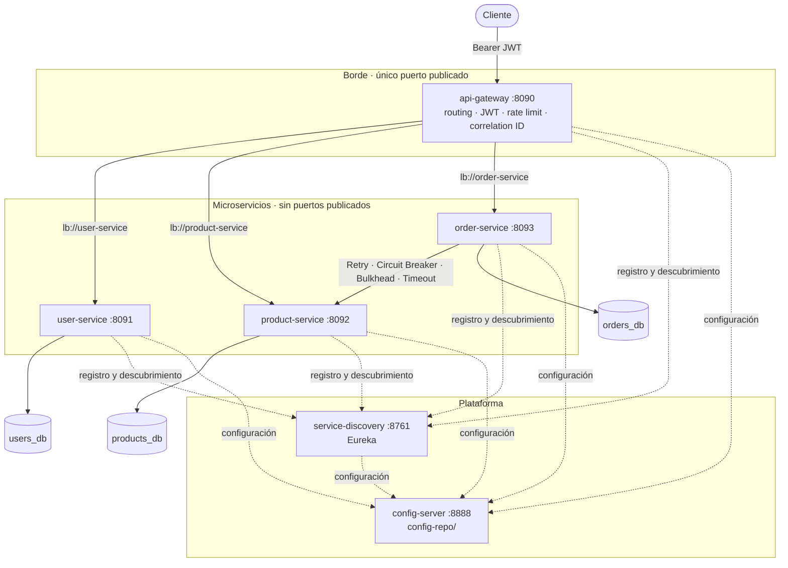

# microservices-platform


Plataforma backend de microservicios con **Java 21, Spring Boot y Spring Cloud**: API Gateway, Service
Discovery, configuración centralizada, JWT, una base de datos por servicio y comunicación entre servicios
que **falla de forma controlada y se recupera sola** (timeout, retry, circuit breaker, bulkhead y rate
limiting). Todo arranca con `docker compose up --build` y se verifica con tests automatizados, incluidos
fallos reales sobre el stack levantado.

## Índice

1. [Visión general](#1-visión-general)
2. [Arquitectura](#2-arquitectura)
3. [Tecnologías](#3-tecnologías)
4. [Servicios](#4-servicios)
5. [Flujo de una petición](#5-flujo-de-una-petición)
6. [Autenticación](#6-autenticación)
7. [Service Discovery](#7-service-discovery)
8. [Configuración](#8-configuración)
9. [Resiliencia](#9-resiliencia)
10. [Estrategia de base de datos](#10-estrategia-de-base-de-datos)
11. [Cómo ejecutarlo](#11-cómo-ejecutarlo)
12. [API](#12-api)
13. [Tests](#13-tests)
14. [Simulación de fallos](#14-simulación-de-fallos)
15. [Documentación de la API (Swagger)](#15-documentación-de-la-api-swagger)
16. [Observabilidad](#16-observabilidad)
17. [Consideraciones para producción](#17-consideraciones-para-producción)
18. [Estructura del proyecto](#18-estructura-del-proyecto)
19. [Autor](#autor)
20. [Licencia](#licencia)

---

## 1. Visión general

Partir un backend en servicios es fácil. Lo difícil es lo que pasa **entre** ellos: cómo se encuentran
sin IPs fijas, cómo comparten configuración sin duplicarla, cómo se protegen sin confiar ciegamente en la
red interna y, sobre todo, qué ocurre cuando uno falla.

Este proyecto resuelve esos problemas con un caso concreto: usuarios, catálogo y pedidos. Para crear un
pedido, `order-service` consulta `product-service` y valida existencia, estado, precio y stock. Esa llamada
síncrona es el punto donde un fallo podría propagarse en cascada, y es donde se concentran los patrones
de resiliencia:

- Si **product-service no responde**, order-service no espera indefinidamente: timeout de 2 s.
- Si **falla de forma transitoria** (503, conexión cortada), se reintenta con backoff; si el error es
  permanente (404, 500), no se reintenta.
- Si **sigue fallando**, el circuit breaker se abre y las peticiones fallan en milisegundos con un error
  claro, sin tocar la red, hasta que el servicio se recupera.
- Si **está lento**, el bulkhead evita que se lleve todos los hilos de order-service.

Nada de esto está solo configurado: hay tests que lo provocan (WireMock en integración, fallos reales
sobre docker compose en E2E) y comprueban el comportamiento.

## 2. Arquitectura



Documentación detallada con más diagramas (secuencias, estados del pedido, modelo de datos, arranque):
[docs/architecture.md](docs/architecture.md). Decisiones y alternativas descartadas:
[docs/architecture-decisions.md](docs/architecture-decisions.md).

## 3. Tecnologías

| Área                  | Tecnología                                                                        |
|-----------------------|-----------------------------------------------------------------------------------|
| Lenguaje y framework  | Java 21, Spring Boot 3.5.4, Maven (multi-módulo, Maven Wrapper)                   |
| Spring Cloud          | 2025.0.0 (Northfields, la línea compatible con Boot 3.5): Gateway (WebFlux), Netflix Eureka, Config Server, LoadBalancer |
| Seguridad             | Spring Security, OAuth2 Resource Server (JWT HS256 con Nimbus), BCrypt            |
| Resiliencia           | Resilience4j 2.2.0 (Circuit Breaker, Retry, Bulkhead) · rate limiter propio en el gateway |
| Persistencia          | Spring Data JPA, PostgreSQL 16, Flyway                                            |
| Cliente HTTP          | `RestClient` `@LoadBalanced` + Apache HttpClient 5                                |
| Observabilidad        | Spring Boot Actuator, Micrometer, Micrometer Tracing (OpenTelemetry bridge), logs JSON (ECS) |
| API                   | OpenAPI 3 / Swagger UI (springdoc 2.8.9)                                          |
| Tests                 | JUnit 5, Mockito, AssertJ, Testcontainers 1.21.4, WireMock 3.13, Awaitility       |
| Contenedores          | Docker (multi-stage, JRE Alpine, usuario sin privilegios), Docker Compose         |

Las versiones se tomaron de BOMs compatibles entre sí: Spring Cloud 2025.0.x para Boot 3.5.x, y
Resilience4j gestionado por el BOM de Spring Cloud.

## 4. Servicios

| Servicio            | Responsabilidad                                                                    |
|---------------------|------------------------------------------------------------------------------------|
| `api-gateway`       | Único punto de entrada. Enruta con Service Discovery, valida el JWT, aplica rate limiting, genera y propaga el correlation ID, traduce sus propios errores a JSON. **Sin lógica de negocio**. |
| `service-discovery` | Eureka Server. Registro de instancias con su estado de salud (protegido con basic auth). |
| `config-server`     | Spring Cloud Config Server. Sirve `config-repo/` por servicio y perfil (protegido con basic auth). |
| `user-service`      | Usuarios, roles (`USER`, `ADMIN`), registro, login con BCrypt y emisión de JWT.    |
| `product-service`   | Catálogo. Lectura para `USER`/`ADMIN`; alta, modificación y borrado lógico solo `ADMIN`. |
| `order-service`     | Pedidos y su ciclo de vida. Valida cada producto contra product-service con Resilience4j. |
| `platform-commons`  | Librería (no es un servicio): correlation ID, formato de error y validación JWT compartidos por los servicios de negocio. Sin dominio. |

## 5. Flujo de una petición

```
Cliente
  │  POST /api/orders   Authorization: Bearer <JWT>
  ▼
api-gateway ── X-Correlation-ID, validación JWT, rate limit por usuario
  │  lb://order-service  (instancia UP según Eureka)
  ▼
order-service ── valida el JWT otra vez y el rol
  │  GET http://product-service/api/products/{id}
  │  + JWT del usuario + X-Correlation-ID + traceparent
  │  Retry( CircuitBreaker( Bulkhead( HTTP con timeout ) ) )
  ▼
product-service ── valida el JWT otra vez y el rol, lee products_db
  │  200 {price, stock, active}
  ▼
order-service ── producto activo, stock suficiente, total = Σ precio × cantidad
  │  guarda el pedido en orders_db (transacción local, abierta después de las llamadas remotas)
  ▼
Cliente  ◄── 201 Created  {status: CREATED, total, items…}   X-Correlation-ID
```

## 6. Autenticación

1. `POST /api/users/register` crea un usuario con rol `USER`. La contraseña se guarda con BCrypt.
2. `POST /api/users/login` devuelve:
   ```json
   { "accessToken": "eyJhbGciOiJIUzI1NiJ9…", "tokenType": "Bearer", "expiresIn": 3600 }
   ```
3. El resto de peticiones llevan `Authorization: Bearer <accessToken>`.

El JWT (HS256) contiene solo `iss`, `sub` (id del usuario), `role`, `iat` y `exp`: ni email ni datos
personales. Se valida la **firma, la expiración, el emisor y que el rol exista**, dos veces:

- en el **gateway**, para que el tráfico no autenticado no entre en la red interna;
- en **cada servicio**, que además aplica su propia autorización (roles por endpoint, pedidos visibles
  solo para su dueño o un ADMIN). Un servicio no confía en una petición por venir de dentro de la red.
  order-service reenvía el JWT del usuario a product-service, que lo valida igual.

El primer `ADMIN` se crea al arrancar a partir de `ADMIN_USERNAME` / `ADMIN_PASSWORD`. Si
`ADMIN_PASSWORD` no está definida, no se crea: no hay credenciales por defecto. Un ADMIN puede cambiar el
rol o deshabilitar otros usuarios (`PATCH /api/users/{id}`).

Otras medidas: el login responde igual (y con el mismo coste de BCrypt) si el usuario no existe, si la
contraseña es incorrecta o si la cuenta está deshabilitada, y está limitado a 10 intentos por minuto e IP.

## 7. Service Discovery

Cada servicio se registra en Eureka al arrancar con la IP que le asigna Docker, y renueva su registro
cada 5 s. El gateway enruta a `lb://user-service`, `lb://product-service` y `lb://order-service`, y
order-service llama a `http://product-service`. Spring Cloud LoadBalancer resuelve esos nombres contra
Eureka en cada llamada. No hay ninguna IP ni `localhost:puerto` en la configuración.

Los servicios publican en Eureka su `/actuator/health` (`eureka.client.healthcheck.enabled`). Si, por
ejemplo, product-service pierde su base de datos, pasa a `DOWN` y el gateway deja de enviarle tráfico.
Dashboard: http://localhost:8761 (usuario y contraseña de `EUREKA_USERNAME` / `EUREKA_PASSWORD`).

## 8. Configuración

El Config Server sirve el directorio [`config-repo/`](config-repo):

| Fichero                   | Contenido                                                                    |
|---------------------------|------------------------------------------------------------------------------|
| `application.yml`         | Común: Eureka, JWT (emisor y `${JWT_SECRET}`), Actuator, logging, tracing, JPA, Flyway |
| `application-docker.yml`  | Perfil `docker`: logs JSON, registro por IP                                  |
| `application-local.yml`   | Perfil `local`: logs de texto, nivel DEBUG, detalles de health               |
| `service-discovery.yml`   | Eureka Server                                                                |
| `api-gateway.yml`         | Rutas, rate limits, timeouts del gateway, Swagger UI                         |
| `user-service.yml` / `product-service.yml` | Puerto, base de datos                                       |
| `order-service.yml`       | Base de datos, URL lógica y timeouts de product-service, Resilience4j        |

- **Los secretos no están en el repositorio**: los ficheros contienen placeholders (`${JWT_SECRET}`,
  `${DB_PASSWORD}`) que el Config Server devuelve sin resolver y cada servicio resuelve con sus variables
  de entorno (definidas en `.env`, excluido de Git; plantilla en [`.env.example`](.env.example)).
- **Perfiles**: `local` (IDE), `docker` (compose) y `test` (tests automatizados, sin Config Server ni Eureka).
- **Resiliencia al arrancar**: los servicios usan `fail-fast` con reintentos. Si el Config Server aún no
  está listo, esperan y reintentan en lugar de arrancar con una configuración incompleta.

## 9. Resiliencia

Se aplica en la única llamada síncrona entre servicios (order-service → product-service) y en el borde.
Valores en [`config-repo/order-service.yml`](config-repo/order-service.yml):

| Patrón              | Configuración                                                    | Caso real                                           |
|---------------------|------------------------------------------------------------------|-----------------------------------------------------|
| **Timeout**         | connect 1 s, read 2 s (gateway → servicios: 10 s)                | product-service colgado o muy lento                  |
| **Retry**           | 3 intentos, backoff exponencial 200 → 400 ms, solo transitorios  | Un 503 o una conexión cortada puntuales              |
| **Circuit Breaker** | ventana de 10, mínimo 5; OPEN con 50 % de fallos u 80 % de llamadas > 1,5 s; 10 s en OPEN; 3 llamadas de prueba | product-service caído o degradado de forma sostenida |
| **Bulkhead**        | 20 llamadas concurrentes, espera máxima 50 ms                    | product-service lento no agota los 200 hilos de order-service |
| **Rate Limiter**    | Gateway: login y registro 10/min por IP; API 100 cada 10 s por usuario | Fuerza bruta, registro masivo, clientes abusivos |

Orden de composición: `Retry( CircuitBreaker( Bulkhead( HTTP con timeout ) ) )`. Cada intento cuenta para
el circuito, y con el circuito abierto se deja de reintentar.

**Estados del Circuit Breaker**

| Estado      | Qué significa                                                                                     |
|-------------|---------------------------------------------------------------------------------------------------|
| `CLOSED`    | Normal: las llamadas pasan y se mide su resultado.                                               |
| `OPEN`      | Se superó el umbral: durante 10 s ninguna llamada llega a product-service y se responde al instante con el fallback. |
| `HALF_OPEN` | Pasado ese tiempo, se dejan pasar 3 llamadas de prueba: si van bien, `CLOSED`; si no, `OPEN` otra vez. |

**Reintentar o no**: se reintentan timeouts, errores de conexión, "ninguna instancia" y `502/503/504`. No se
reintentan `400/401/403/404/409` (repetirlos da el mismo resultado) ni `500` (error del propio servicio:
cuenta para el circuit breaker, pero no se repite). Solo hay **una** capa de reintentos: el reintento del
balanceador está desactivado y el cliente HTTP no reintenta por su cuenta.

**Fallback**: no se inventan precios ni stock. Cada fallo se convierte en un error específico y rápido:

| Situación                                                   | Respuesta de order-service          |
|-------------------------------------------------------------|-------------------------------------|
| Caído, sin instancias, 503 persistente o circuito abierto  | `503 PRODUCT_SERVICE_UNAVAILABLE`   |
| No responde a tiempo tras los reintentos                    | `504 PRODUCT_SERVICE_TIMEOUT`       |
| Responde 500                                                | `502 PRODUCT_SERVICE_ERROR`         |
| Bulkhead lleno                                              | `503 PRODUCT_SERVICE_BUSY`          |
| El producto no existe / está inactivo                       | `422 PRODUCT_NOT_FOUND` / `PRODUCT_INACTIVE` |

Todas las respuestas de error de la plataforma tienen el mismo formato, sin stack traces:

```json
{
  "timestamp": "2026-09-23T17:48:54.528Z",
  "status": 503,
  "code": "PRODUCT_SERVICE_UNAVAILABLE",
  "message": "Product service is temporarily unavailable",
  "path": "/api/orders",
  "correlationId": "demo-retry-24981"
}
```

## 10. Estrategia de base de datos

**Database-per-service**: `users_db`, `products_db` y `orders_db` son tres PostgreSQL independientes, cada
uno con su propio usuario y contraseña. Ningún servicio tiene credenciales de la base de datos de otro.

- order-service **nunca** consulta `products_db`: obtiene precio, estado y stock por la API de
  product-service.
- `orders.user_id` y `order_items.product_id` son referencias lógicas, sin claves foráneas entre bases de
  datos.
- El precio se copia en el pedido (`unit_price`): cambiar el precio de un producto no altera pedidos ya
  creados.
- Cada servicio gestiona su esquema con Flyway (`V1__create_users.sql`, `V1__create_products.sql`,
  `V1__create_orders.sql`, `V2__create_order_items.sql`), y Hibernate solo lo valida
  (`ddl-auto: validate`).
- El borrado de productos es lógico (`active = false`): los pedidos existentes siguen siendo coherentes.

## 11. Cómo ejecutarlo

Requisitos: Docker con Docker Compose. Para ejecutar los tests hace falta además Java 21 (Maven se incluye
con el wrapper `./mvnw`).

```bash
# 1. Variables de entorno: copiar la plantilla y cambiar TODOS los secretos
cp .env.example .env
#    por ejemplo, para cada contraseña y para JWT_SECRET (mínimo 32 bytes):
openssl rand -base64 48

# 2. Construir y arrancar (la primera vez compila las 6 imágenes; tarda unos minutos)
docker compose up --build -d

# 3. Esperar a que todo esté healthy (config → discovery → servicios → gateway)
docker compose ps
```

| URL                                    | Qué es                                         |
|----------------------------------------|------------------------------------------------|
| http://localhost:8090                  | API Gateway (único punto de entrada de la API) |
| http://localhost:8090/swagger-ui.html  | Swagger UI de los tres servicios               |
| http://localhost:8761                  | Dashboard de Eureka (basic auth)               |

Para usar la simulación de fallos, arrancar con el override `chaos` (ver [sección 14](#14-simulación-de-fallos)):

```bash
docker compose -f docker-compose.yml -f docker-compose.chaos.yml up --build -d
```

Parar: `docker compose down` (con `-v` también se borran los datos).

**Perfil `local`** (servicios desde el IDE o con `java -jar`):

1. Arrancar solo las bases de datos: `docker compose up -d users-db products-db orders-db` (publicadas en
   `127.0.0.1:5441-5443`).
2. Arrancar cada servicio con `SPRING_PROFILES_ACTIVE=local`, en el orden config-server → service-discovery
   → servicios → gateway, con estas variables de entorno:
   - **Todos**: `CONFIG_SERVER_USERNAME`, `CONFIG_SERVER_PASSWORD` y `JWT_SECRET`, más
     `EUREKA_SERVER_URL=http://<EUREKA_USERNAME>:<EUREKA_PASSWORD>@localhost:8761/eureka/`.
   - **service-discovery**: además, `EUREKA_USERNAME` y `EUREKA_PASSWORD`.
   - **Cada servicio con base de datos**: `DB_USERNAME` y `DB_PASSWORD` de la suya. Las URLs de las bases
     de datos y de Config Server tienen valores por defecto para `localhost`.
   - **config-server**: lee `../config-repo/` (relativo al directorio de trabajo). Otra ruta se indica con
     `CONFIG_REPO_LOCATION=file:/ruta/config-repo/`.

## 12. API

Todas las rutas pasan por el gateway (`http://localhost:8090`).

| Método   | Ruta                          | Rol          | Descripción                                        |
|----------|-------------------------------|--------------|----------------------------------------------------|
| `POST`   | `/api/users/register`         | público      | Registro (rol USER)                                |
| `POST`   | `/api/users/login`            | público      | Login → JWT                                        |
| `GET`    | `/api/users/me`               | USER/ADMIN   | Usuario del token                                  |
| `GET`    | `/api/users/{id}`             | USER/ADMIN   | Un USER solo puede verse a sí mismo               |
| `GET`    | `/api/users`                  | ADMIN        | Listado paginado                                   |
| `PATCH`  | `/api/users/{id}`             | ADMIN        | Cambiar rol o habilitar/deshabilitar               |
| `GET`    | `/api/products`               | USER/ADMIN   | Catálogo paginado (USER solo ve productos activos) |
| `GET`    | `/api/products/{id}`          | USER/ADMIN   | Detalle (incluye `active` y `stock`)               |
| `POST`   | `/api/products`               | ADMIN        | Crear producto                                     |
| `PUT`    | `/api/products/{id}`          | ADMIN        | Actualizar (bloqueo optimista)                     |
| `DELETE` | `/api/products/{id}`          | ADMIN        | Borrado lógico                                     |
| `POST`   | `/api/orders`                 | USER/ADMIN   | Crear pedido (valida contra product-service)       |
| `GET`    | `/api/orders`                 | USER/ADMIN   | Mis pedidos (ADMIN: todos)                         |
| `GET`    | `/api/orders/{id}`            | USER/ADMIN   | Solo el dueño o un ADMIN                           |
| `POST`   | `/api/orders/{id}/cancel`     | USER/ADMIN   | Cancelar (solo en estado `CREATED`)                |
| `PATCH`  | `/api/orders/{id}/status`     | ADMIN        | `CREATED → PROCESSING → COMPLETED \| FAILED`       |

Ejemplo completo con `curl`:

```bash
GW=http://localhost:8090

curl -s -X POST $GW/api/users/register -H 'Content-Type: application/json' \
  -d '{"username":"alice","email":"alice@example.com","password":"S3cure-Passw0rd"}'

TOKEN=$(curl -s -X POST $GW/api/users/login -H 'Content-Type: application/json' \
  -d '{"username":"alice","password":"S3cure-Passw0rd"}' | sed -n 's/.*"accessToken":"\([^"]*\)".*/\1/p')

# Crear un producto requiere ADMIN (login con ADMIN_USERNAME / ADMIN_PASSWORD de .env)
ADMIN=$(curl -s -X POST $GW/api/users/login -H 'Content-Type: application/json' \
  -d '{"username":"admin","password":"<ADMIN_PASSWORD>"}' | sed -n 's/.*"accessToken":"\([^"]*\)".*/\1/p')
curl -s -X POST $GW/api/products -H "Authorization: Bearer $ADMIN" -H 'Content-Type: application/json' \
  -d '{"name":"Keyboard","price":49.90,"stock":10}'

curl -s -X POST $GW/api/orders -H "Authorization: Bearer $TOKEN" -H 'Content-Type: application/json' \
  -H 'X-Correlation-ID: my-first-order' -d '{"items":[{"productId":1,"quantity":2}]}'
```

## 13. Tests

```bash
./mvnw test          # o "mvn test": unitarios + integración (necesita Docker para Testcontainers)
```

| Módulo              | Qué se prueba                                                                                  |
|---------------------|-----------------------------------------------------------------------------------------------|
| `platform-commons`  | Validación JWT (firma, expiración, emisor, rol), longitud mínima del secreto, correlation ID    |
| `config-server`     | Servidor real sobre `config-repo/`: precedencia de ficheros, secretos como placeholders, basic auth |
| `service-discovery` | Registro de instancias con credenciales; rechazo de registros anónimos                         |
| `user-service`      | Registro, login, claims mínimos del JWT, hash BCrypt, 401/403, visibilidad entre usuarios, usuario deshabilitado, Flyway (**PostgreSQL con Testcontainers**) |
| `product-service`   | CRUD, roles por operación, borrado lógico, validación, modo chaos y su restricción a loopback (**Testcontainers**) |
| `order-service`     | Reglas de negocio, estados del pedido y propiedad (**Testcontainers**). **Resiliencia** con product-service simulado por WireMock: 503 transitorio reintentado, 503 persistente, 404/403 sin reintento, 500 sin reintento, **timeout**, conexión cortada, **CLOSED → OPEN → HALF_OPEN → CLOSED**, fallo en HALF_OPEN, apertura por **llamadas lentas**, **bulkhead** lleno, servicio **caído** y **sin instancias** |
| `api-gateway`       | Rutas reales de `config-repo`: **routing** por discovery, **JWT** (ausente, caducado, falsificado), **rate limiting** por IP y por usuario, **correlation ID** (generado, respetado, saneado, sin duplicar), 503 sin instancias, 504 por timeout, 404 |

**Tests extremo a extremo** contra el stack de docker compose, siempre a través del gateway:

```bash
docker compose -f docker-compose.yml -f docker-compose.chaos.yml up --build -d
./mvnw -Pe2e test -pl e2e-tests
```

| Test                  | Escenario                                                                                   |
|-----------------------|---------------------------------------------------------------------------------------------|
| `OrderFlowE2ETest`    | Register → Login → JWT → Create Product → Create Order → Order Service → Product Service → Response; validación de stock y producto inexistente; **el mismo correlationId y traceId en los logs de gateway, order-service y product-service** |
| `SecurityE2ETest`     | 401 sin token, JWT manipulado, roles, pedidos de otro usuario, **microservicios no accesibles salvo por el gateway** |
| `ResilienceE2ETest`   | 503 real → **3 intentos** (contados en los logs de product-service) → error controlado; **circuito abierto**, fallo inmediato y **recuperación**; latencia de 5 s → **504 en ~7 s**; **product-service parado** y **base de datos parada** → 503 controlado y recuperación automática |
| `RateLimitE2ETest`    | Fuerza bruta en login → `429` con `Retry-After`                                              |

`ResilienceE2ETest` se omite automáticamente si product-service no tiene el perfil `chaos`.

## 14. Simulación de fallos

Mecanismo **solo de desarrollo**, separado de producción:

- el endpoint `/internal/chaos` de product-service solo existe con el perfil `chaos`, que activa
  [`docker-compose.chaos.yml`](docker-compose.chaos.yml);
- solo acepta peticiones desde el propio contenedor (loopback): no se expone por el gateway ni a la red;
- al arrancar con ese perfil, el servicio avisa en el log con un WARN.

```bash
docker compose -f docker-compose.yml -f docker-compose.chaos.yml up -d

./scripts/chaos.sh error-503        # HTTP 503: retry → circuit breaker → fallback
./scripts/chaos.sh error-500        # HTTP 500: sin retry, 502 PRODUCT_SERVICE_ERROR
./scripts/chaos.sh delay 5000       # lento: timeout de 2 s por intento → 504
./scripts/chaos.sh delay 1600       # lento pero bajo el timeout: el circuito se abre por llamadas lentas
./scripts/chaos.sh error-503 0.5    # solo el 50 % de las peticiones
./scripts/chaos.sh off
./scripts/chaos.sh stop | start     # product-service caído
./scripts/chaos.sh db-stop | db-start   # base de datos de product-service caída
./scripts/chaos.sh circuit          # estado del circuit breaker de order-service
```

Demostración guiada de toda la cadena `failure → timeout → retry → circuit breaker → fallback →
recuperación`:

```bash
./scripts/resilience-demo.sh
```

Salida real (resumida):

```
== 1. Todo funciona: pedido creado (201)
201 0.029s
== 2. product-service devuelve 503: order-service reintenta 3 veces y responde un error controlado
503 0.631s  {"code":"PRODUCT_SERVICE_UNAVAILABLE", ...}
  fallos inyectados en product-service para demo-retry-24981: 3
== 3. Más fallos: el circuit breaker se abre y order-service falla al instante (sin llamar a product-service)
503 0.013s  {"code":"PRODUCT_SERVICE_UNAVAILABLE", ...}
  estado: OPEN
== 4. product-service se recupera: tras 10 s en OPEN el circuito pasa a HALF_OPEN y se cierra
201 0.028s
  estado: CLOSED
== 5. product-service lento (5 s): timeout de 2 s por intento, 504 en ~7 s en lugar de esperar 15 s
504 6.627s  {"code":"PRODUCT_SERVICE_TIMEOUT", ...}
```

## 15. Documentación de la API (Swagger)

Swagger UI en el gateway: **http://localhost:8090/swagger-ui.html**. El desplegable de la esquina superior
derecha permite elegir la especificación de **User Service**, **Product Service** u **Order Service**. Cada
servicio genera la suya y el gateway la expone en `/docs/{users|products|orders}/v3/api-docs`, sin mezclarlas.

Cada especificación documenta endpoints, cuerpos de petición y respuesta, códigos HTTP, errores (con el
esquema `ApiError`) y autenticación Bearer. Para probar endpoints protegidos: hacer login, pulsar
**Authorize** y pegar el `accessToken`. "Try it out" envía la petición al gateway, igual que un cliente real.

## 16. Observabilidad

- **Actuator** en todos los servicios: `/actuator/health` (con `liveness` y `readiness`, usados por los
  healthchecks de Docker), `/actuator/info` y `/actuator/metrics` (este último solo para ADMIN). En
  order-service, además, `circuitbreakers`, `circuitbreakerevents`, `retries` y `bulkheads`.
- **Logs estructurados** en JSON (perfil `docker`): `@timestamp`, `service.name`, `log.level`, `traceId`,
  `spanId`, `correlationId`, `message`. Nunca contraseñas, tokens ni secretos. Cada servicio escribe una
  línea de acceso por petición (método, ruta, estado, duración).
- **Correlation ID**: el gateway lo genera, o respeta el del cliente si es válido, y lo propaga
  (`X-Correlation-ID`) a order-service y product-service. Vuelve en la respuesta y en los errores.
- **Trazas**: Micrometer Tracing con el bridge de OpenTelemetry propaga el contexto W3C (`traceparent`). Una
  petición tiene el mismo `traceId` en gateway, order-service y product-service:

```bash
docker compose logs api-gateway order-service product-service | grep my-first-order
```

```json
{"service.name":"product-service","traceId":"94191e5dcc1b8de682bdc941093ab9b7","correlationId":"doc-example-001","message":"GET /api/products/1 -> 200 (5 ms)"}
{"service.name":"order-service","traceId":"94191e5dcc1b8de682bdc941093ab9b7","correlationId":"doc-example-001","message":"Order 379caca7-… created for user 92c78d0e-… with 1 items, total 49.90"}
{"service.name":"order-service","traceId":"94191e5dcc1b8de682bdc941093ab9b7","correlationId":"doc-example-001","message":"POST /api/orders -> 201 (18 ms)"}
{"service.name":"api-gateway","traceId":"94191e5dcc1b8de682bdc941093ab9b7","correlationId":"doc-example-001","message":"POST /api/orders -> 201 (24 ms)"}
```

## 17. Consideraciones para producción

Qué faltaría para una implementación empresarial real:

- **Consistencia del stock**: hoy el pedido valida el stock pero no lo reserva, y dos pedidos simultáneos
  podrían venderlo dos veces. Haría falta una reserva en product-service con una saga (orquestada o con
  eventos, por ejemplo Kafka + outbox) y compensación si el pedido falla.
- **Idempotencia** de `POST /api/orders` (cabecera `Idempotency-Key`) para que un cliente pueda reintentar
  sin duplicar pedidos.
- **Claves JWT asimétricas** (RS256/ES256) con JWKS publicado por el emisor y rotación de claves, o un
  proveedor de identidad (Keycloak, Auth0) con OAuth2/OIDC. Revocación con tokens de vida corta y refresh
  tokens.
- **Secretos** en un gestor (Vault, AWS Secrets Manager) en lugar de `.env`. Config Server con backend Git
  (auditoría) y cifrado de propiedades.
- **Alta disponibilidad**: varias réplicas de gateway, Eureka (en modo peer) y Config Server. En Kubernetes,
  el service discovery y la configuración los podrían asumir la propia plataforma (Services,
  ConfigMaps/Secrets) o un service mesh.
- **Rate limiting distribuido** (Redis) o en el balanceador o WAF, y `forward-headers-strategy` solo detrás
  de proxies de confianza.
- **TLS** extremo a extremo y mTLS entre servicios.
- **Observabilidad completa**: exportar trazas (OTLP → Collector → Tempo/Jaeger), métricas a Prometheus con
  dashboards y alertas sobre el estado de los circuitos, y logs a un agregador. Es lo que se implementó en
  el proyecto anterior del portfolio, observability-platform.
- **Bases de datos gestionadas** con backups, réplicas y pool de conexiones dimensionado. Los timeouts y
  umbrales de resiliencia se ajustarían con datos reales de latencia.
- **CI/CD**: pipeline con tests, análisis estático, escaneo de dependencias e imágenes, y despliegues
  graduales (canary / blue-green).
- **Contract testing** (Spring Cloud Contract / Pact) entre order-service y product-service para detectar
  cambios de API incompatibles antes de desplegar.

## 18. Estructura del proyecto

```
microservices-platform/
├── api-gateway/                 Spring Cloud Gateway: seguridad, rate limiting, correlation ID, errores
├── config-server/               Spring Cloud Config Server
├── service-discovery/           Eureka Server
├── user-service/                Usuarios, autenticación y JWT
├── product-service/             Catálogo (incluye chaos/ solo con el perfil chaos)
├── order-service/               Pedidos + cliente resiliente de product-service
│   └── src/main/java/…/order/
│       ├── client/              ProductClient (HTTP) y ResilientProductClient (Resilience4j)
│       ├── config/              RestClient @LoadBalanced, Apache HttpClient, seguridad
│       ├── domain/              Order, OrderItem, OrderStatus, repositorio
│       ├── service/             Casos de uso
│       └── web/                 Controlador y DTOs
├── platform-commons/            Correlation ID, ApiError, handler global, JWT (sin dominio)
├── config-repo/                 Configuración centralizada por servicio y perfil
├── e2e-tests/                   Tests extremo a extremo (perfil Maven e2e)
├── docs/
│   ├── architecture.md          Arquitectura con diagramas Mermaid
│   └── architecture-decisions.md  ADRs
├── scripts/
│   ├── chaos.sh                 Inyección de fallos
│   └── resilience-demo.sh       Demostración guiada de la resiliencia
├── docker-compose.yml
├── docker-compose.chaos.yml     Override de desarrollo: perfil chaos
├── .env.example
└── pom.xml                      Proyecto Maven multi-módulo
```

Cada servicio tiene su propio `Dockerfile` (multi-stage: compila con Maven y ejecuta con JRE 21 Alpine y un
usuario sin privilegios) y sus migraciones Flyway en `src/main/resources/db/migration`.

## Autor

- **LinkedIn:** [samuel-martinez-beleno](https://www.linkedin.com/in/samuel-martinez-beleno/)
- **GitHub:** [samsenpro](https://github.com/samsenpro)

## Licencia

Distribuido bajo la licencia MIT. Ver [LICENSE](LICENSE).
